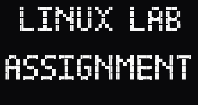

<p align="center">
  
</p>

# Linux Lab Assignment 1 – MyProject

[](https://github.com/AnilYadav17/Linux_lab_assignment-MyProject)
[](https://github.com/AnilYadav17/Linux_lab_assignment-MyProject)

**Submitted by:** Anil Yadav  
**Course:** B.Tech V Sem, CS-505 (Linux Lab)  
**Date:** 09/10/2025

---

## 📝 Project Overview
This repository contains **Linux Lab Assignment 1**. The assignment demonstrates the use of Linux commands for:

- File and directory management  
- Permissions handling  
- Creating and manipulating files (CSV, text)  
- Process monitoring and management  
- Git and GitHub version control  

All tasks were performed using terminal commands on Linux.

---

## 📂 Project Structure

```
MyProject/
├── 1.sh
├── 2.sh
├── 3.sh
├── 4.sh
├── 5.sh
├── backup/
│   └── report.txt
├── copy_file.png
├── count_lines.png
├── Create_dir_1_o.png
├── create_dir_1.png
├── data.csv
├── list_dir.png
├── permission_dir_1.png
├── process_top.png
├── README.md
└── report.txt
```

- **Scripts (`1.sh` … `5.sh`)**: Contain commands for the respective tasks.  
- **backup/**: Contains the copied report file without overwriting.  
- **Images**: Screenshots of directory creation, permissions, and commands.  
- **data.csv**: Sample CSV used for line counting task.  
- **report.txt**: Linux Lab report created for submission.

---

## 🚀 Commands Used (Summary)

1. **Create Directory and Set Permissions**
```bash
mkdir ~/MyProject
chmod 700 ~/MyProject
```

2. **List Files with Hidden and Human-Readable Sizes**
```bash
ls -lah
```

3. **Create CSV File and Count Lines**
```bash
echo -e "Name,Age,City\nAnil,19,Indore\nJugal,20,Indore\nYuvraj,19,Dewas" > data.csv
wc -l data.csv
```

4. **Create Report and Copy Safely**
```bash
echo -e "This is my Linux Lab report for Assignment 1.\nSubmitted by: Anil Yadav" > ~/report.txt
mkdir backup
cp -n ~/report.txt backup/
```

5. **Monitor and Kill High CPU Process**
```bash
top
kill -9 <PID>
```

---

## 📸 Screenshots

- **Directory Creation & Permissions**: `create_dir_1.png`, `permission_dir_1.png`  
- **File Listing**: `list_dir.png`  
- **CSV Counting**: `count_lines.png`  
- **Copy Backup**: `copy_file.png`  
- **Process Monitoring**: `process_top.png`

---

## ✅ Notes

- All tasks performed using **terminal commands**.  
- Folder `MyProject` contains **all assignment files**.  
- This repo can be cloned to reproduce the lab environment exactly.

---

**GitHub Repo:** [Linux_lab_assignment-MyProject](https://github.com/AnilYadav17/Linux_lab_assignment-MyProject)

